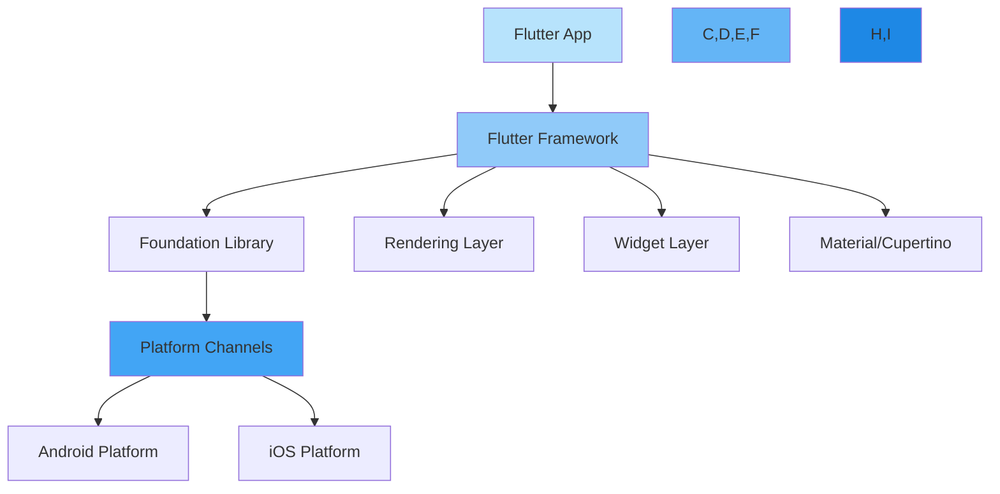
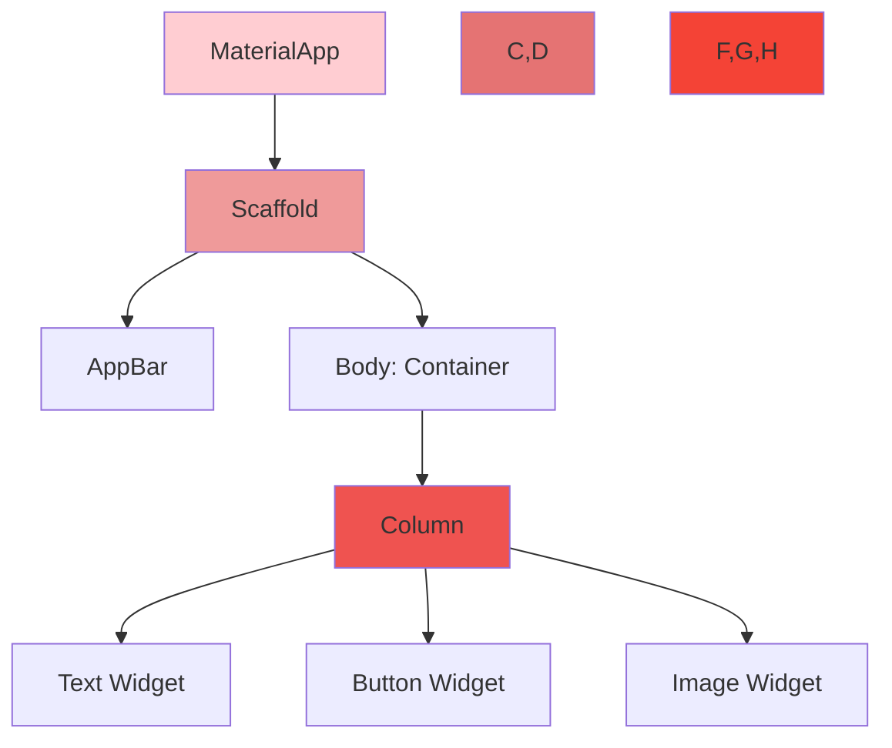
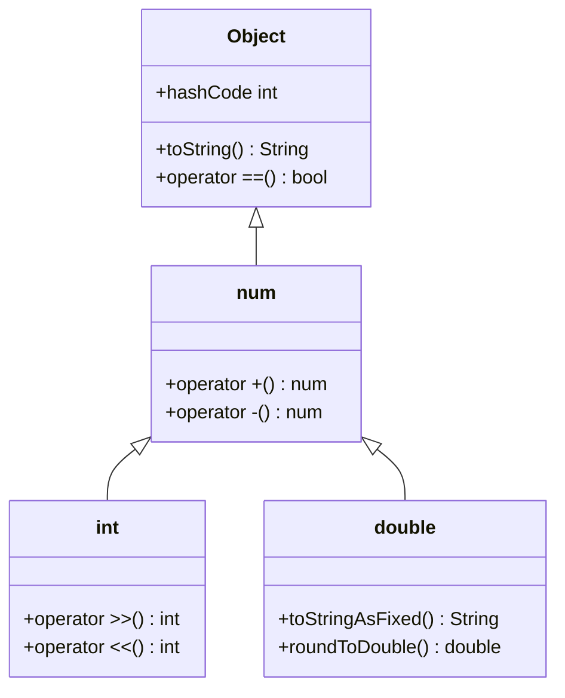
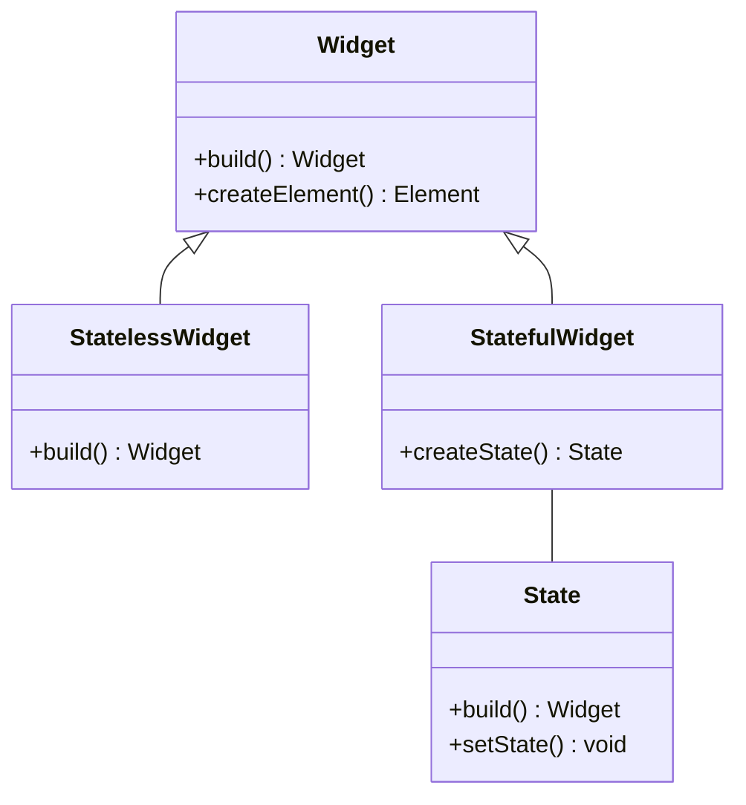
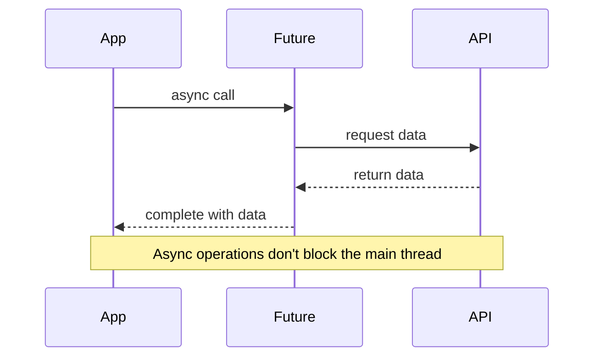
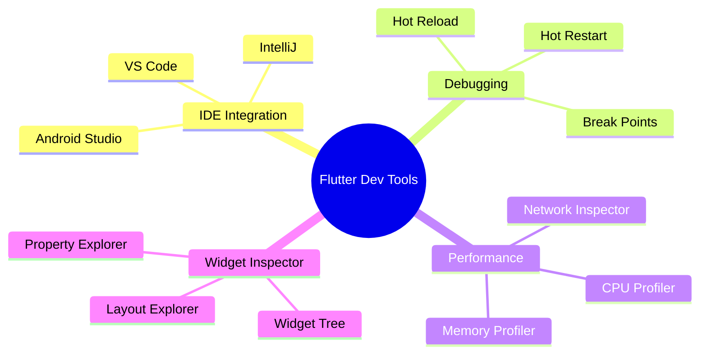

# Introduction to Flutter and Dart

## About
This lesson introduces students to Flutter framework and the Dart programming language. Students will learn about the advantages of Flutter for cross-platform development and get hands-on experience with Dart's core concepts.

## Flutter Architecture Overview

## Widget Tree Concept

## Development Environment Setup Flow

## Course Schedule

| Lesson | Time | Type | Skills |
|--------|------|------|---------|
| What is Flutter? | 30 min | Lecture | Understanding Flutter's architecture, widget tree, and hot reload |
| Development Environment Setup | 45 min | Code-Along | Installing Flutter SDK, setting up IDE, creating first project |
| Introduction to Dart | 45 min | Lecture | Dart syntax, variables, types, functions, and null safety |
| Dart Programming Lab | 60 min | Lab | Hands-on practice with Dart programming concepts |
| Break | 15 min | Break | |
| Object-Oriented Programming in Dart | 45 min | Lecture | Classes, inheritance, interfaces, and mixins |
| OOP Practice | 45 min | Code-Along | Building classes and implementing inheritance |
| **Total Morning Content** | **3.5 hours** | | |

## Dart Type System Overview

## Object-Oriented Programming Concepts

## Level Up Content

| Topic | Time | Skills |
|-------|------|---------|
| Dart Async Programming | 30 min | Understanding Future, async/await, and Streams |
| Flutter DevTools | 30 min | Using Flutter DevTools for debugging and performance optimization |

## Async Programming Visualization

## Development Tools Ecosystem

## Key Takeaways

1. **Flutter's Advantages**
   - Single codebase for multiple platforms
   - Hot reload for rapid development
   - Rich widget library
   - Strong performance

2. **Dart Features**
   - Type safety
   - Null safety
   - Object-oriented
   - Async support

3. **Development Best Practices**
   - Use version control
   - Follow widget composition patterns
   - Implement proper state management
   - Write clean, maintainable code

---
© 2025 General Assembly
