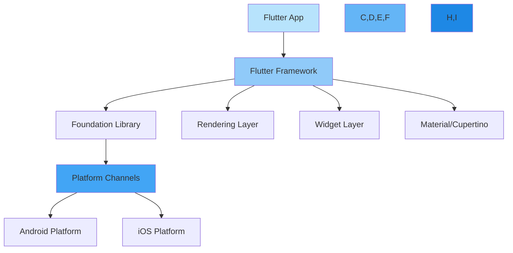
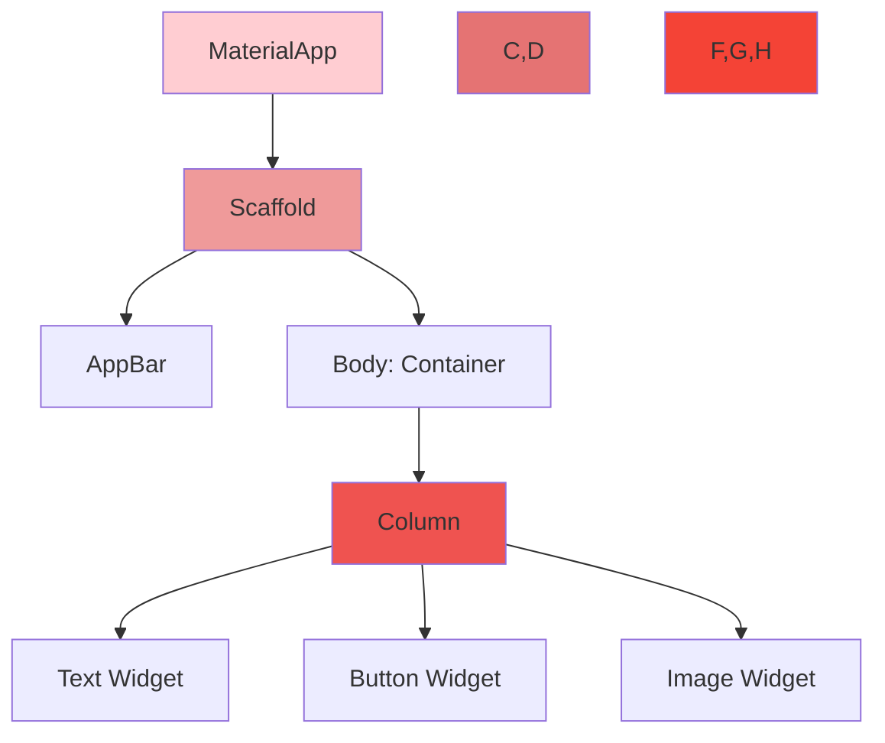
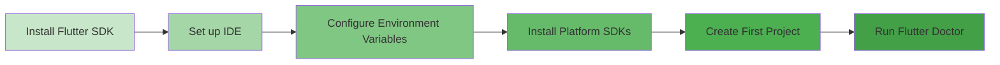

# Introduction to Flutter and Dart

## About
This lesson introduces students to Flutter framework and the Dart programming language. Students will learn about the advantages of Flutter for cross-platform development and get hands-on experience with Dart's core concepts.

## What is Flutter?

Flutter is Google's UI toolkit for building beautiful, natively compiled applications for mobile, web, and desktop from a single codebase. Here's how Flutter's architecture enables this:



### Key Features
- **Hot Reload**: Make changes and see them instantly
- **Single Codebase**: Write once, deploy everywhere
- **Custom Widgets**: Build beautiful native interfaces
- **High Performance**: Direct access to platform APIs

## Understanding Widget Trees

In Flutter, everything is a widget. Widgets form a hierarchy that describes your app's UI:



## Development Environment Setup

Follow these steps to set up your Flutter development environment:



### Setup Steps
1. Download Flutter SDK from flutter.dev
2. Extract and add to PATH
3. Install VS Code or Android Studio
4. Install Flutter and Dart plugins
5. Run `flutter doctor` to verify setup

## Course Schedule

| Lesson | Time | Type | Skills |
|--------|------|------|---------|
| What is Flutter? | 30 min | Lecture | Understanding Flutter's architecture, widget tree, and hot reload |
| Development Environment Setup | 45 min | Code-Along | Installing Flutter SDK, setting up IDE, creating first project |
| Introduction to Dart | 45 min | Lecture | Dart syntax, variables, types, functions, and null safety |
| Dart Programming Lab | 60 min | Lab | Hands-on practice with Dart programming concepts |
| Break | 15 min | Break | |
| Object-Oriented Programming in Dart | 45 min | Lecture | Classes, inheritance, interfaces, and mixins |
| OOP Practice | 45 min | Code-Along | Building classes and implementing inheritance |
| **Total Morning Content** | **3.5 hours** | | |

## Introduction to Dart

Dart is a client-optimized language for fast apps on any platform. Key features include:

### Variables and Types
- Strong typing with type inference
- `var`, `final`, and `const` keywords
- Built-in types: `int`, `double`, `String`, `bool`, `List`, `Map`
- Null safety with `?` and `!` operators

### Functions
```dart
// Named parameters with null safety
void printUserInfo({
    required String name,
    int? age,
    String? email
}) {
    print('Name: $name');
    if (age != null) print('Age: $age');
    if (email != null) print('Email: $email');
}
```

### Object-Oriented Programming
- Classes and objects
- Inheritance and interfaces
- Abstract classes and mixins
- Factory constructors
- Method overriding

## Level Up Content

| Topic | Time | Skills |
|-------|------|---------|
| Dart Async Programming | 30 min | Understanding Future, async/await, and Streams |
| Flutter DevTools | 30 min | Using Flutter DevTools for debugging and performance optimization |

### Async Programming
```dart
// Example of async/await in Dart
Future<String> fetchUserData() async {
    final response = await http.get('api/user');
    return response.body;
}
```

### DevTools Features
- Widget Inspector
- Performance Profiling
- Memory Analysis
- Network Monitoring
- Source-level Debugger

## Key Takeaways

1. **Flutter's Advantages**
   - Single codebase for multiple platforms
   - Hot reload for rapid development
   - Rich widget library
   - Strong performance

2. **Dart Features**
   - Type safety
   - Null safety
   - Object-oriented
   - Async support

3. **Development Best Practices**
   - Use version control
   - Follow widget composition patterns
   - Implement proper state management
   - Write clean, maintainable code

---
© 2025 General Assembly
